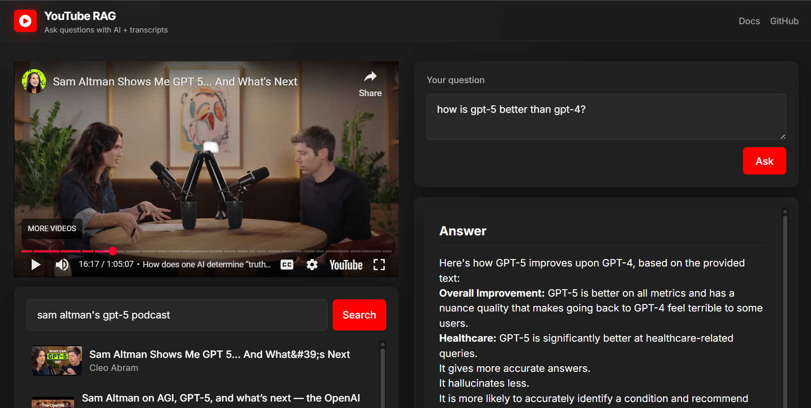

# 🎬 YouTube-RAG

Ask questions about any YouTube video using Retrieval-Augmented Generation (RAG) powered by Google Gemini and semantic search.  
Paste a YouTube URL or ID, load the video, and get instant, context-aware answers!

---

<p align="center">
  
</p>

---

## 🚀 Features

- 🎥 **YouTube Transcript Extraction**  
  Fetches and processes English transcripts from YouTube videos.

- 🧩 **Semantic Chunking & Embedding**  
  Splits transcripts and embeds them for efficient semantic search.

- 🔍 **Vector Search with FAISS**  
  Finds the most relevant transcript chunks for your question.

- 🤖 **RAG with Gemini**  
  Uses Google Gemini to generate answers based on the transcript context.

- 💻 **Modern React Frontend**  
  Clean UI, Markdown rendering, and loading indicators.

---

## 🛠️ Tech Stack

<p align="center">
  
  
  
  
  
  
  
  
</p>

---

## 📁 Project Structure

```
Youtube-RAG/
├── backend/
│   ├── app.py
│   ├── requirements.txt
│   └── .env
├── frontend/
│   ├── src/
│   │   ├── App.jsx
│   │   └── components/
│   │       ├── Header.jsx
│   │       ├── VideoInput.jsx
│   │       ├── QuestionInput.jsx
│   │       ├── AnswerBox.jsx
│   │       └── Loader.jsx
│   ├── package.json
│   └── ...
├── .gitignore
└── README.md
```

---

## ⚡ Quickstart

### 1. Clone the Repository

```sh
git clone https://github.com/yourusername/Youtube-RAG.git
cd Youtube-RAG
```

### 2. Backend Setup

```sh
cd backend
python -m venv venv
venv\Scripts\activate  # On Windows
pip install -r requirements.txt
```

- Create a `.env` file in `backend/`:
  ```
  GOOGLE_API_KEY=your_gemini_api_key_here
  ```

- Start the backend server:
  ```sh
  python app.py
  ```

### 3. Frontend Setup

```sh
cd ../frontend
npm install
npm start
```

---

## 📝 Usage

1. **Enter a YouTube URL or ID** and click "Load".
2. **Ask a question** about the video content.
3. **View the answer** rendered with Markdown formatting.

---

## 🔑 Environment Variables

- `GOOGLE_API_KEY` (in `backend/.env`): Your Google Gemini API key.

---

## 📜 License

Gaurav Purohit
